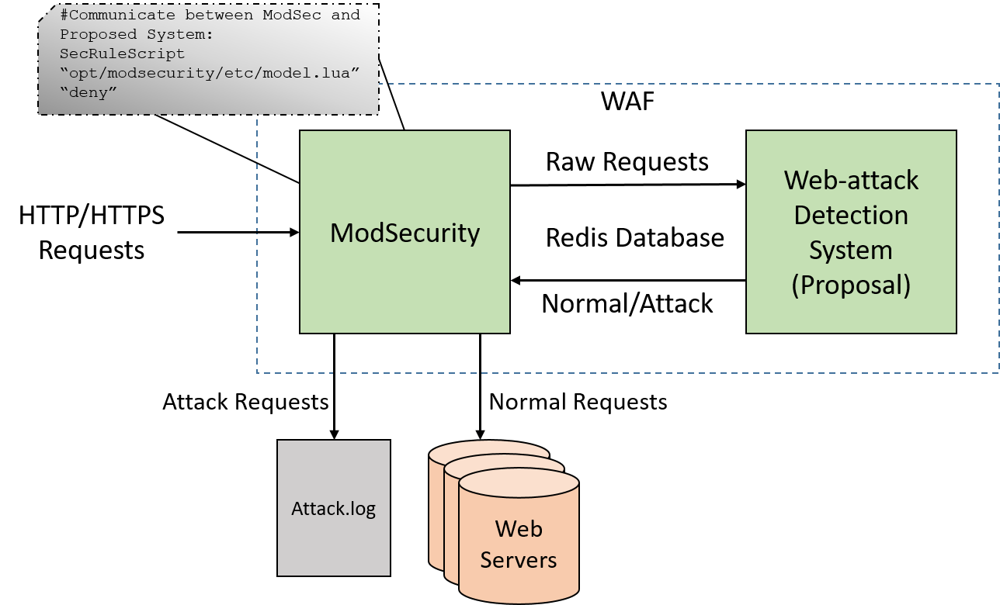

# ModSecurity x Deep Learning Model for Web Attack Detection

## Overall Architecture



## Requirements

### Redis

**Ubuntu**
```sh
sudo apt-get install redis-server
```
**CentOS**
```sh
sudo yum install redis
```

### Python libraries

**Ubuntu**
```sh
sudo apt-get install python3
sudo apt-get -y install python3-pip
sudo pip3 install setuptools
sudo pip3 install redis
sudo pip3 install keras
sudo pip3 install tensorflow
sudo pip3 install pandas
```
**CentOS**
```sh
sudo yum install epel-release 
sudo yum install python36
wget https://bootstrap.pypa.io/get-pip.py
python36 get-pip.py
pip3 install redis
sudo pip3 install keras
sudo pip3 install tensorflow
sudo pip3 install pandas
```


### Lua Programming Language libraries

**Ubuntu**
```sh
sudo apt-get install lua5.1 liblua5.1-0
sudo apt-get install luarocks
sudo luarocks install redis-lua sha1
```
**CentOS**
```sh
sudo yum install lua lua-devel.x86_64 lua-devel.i686
sudo yum install luarocks
sudo luarocks install redis-lua sha1
```

## Implementation

### git

**Ubuntu**
```sh
sudo apt-get install automake autoconf m4 libtool
sudo apt-get install apache2-dev libxml2-dev
git clone https://bkcs.dynu.net/lamnt/bkcs-modsecurity.git
cd bkcs-modsecurity
```
**CentOS**
```sh
sudo yum install m4 gcc make automake autoconf libtool
sudo yum install pcre pcre-devel libxml2 libxml2-devel curl curl-devel httpd-devel
git clone https://bkcs.dynu.net/lamnt/bkcs-modsecurity.git
cd bkcs-modsecurity
```

### Running and configuring Deep Learning Model

**Ubuntu**
```sh
sudo ./config_model.sh
```
**CentOS**
```sh
sudo ./config_model_centos.sh
```

### Running and configuring Modsecurity

**Ubuntu**
```sh
sudo ./config_mod.sh
```

**CentOS**
```sh
sudo ./config_mod_centos.sh
```

## To avoid any errors when implementing, we can use Docker
```sh
sudo docker build --no-cache -t mod_test .
```